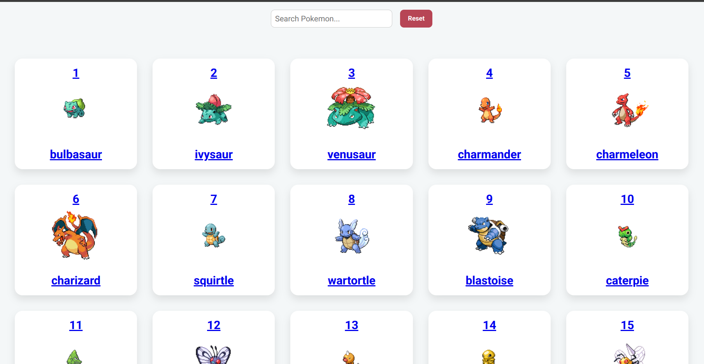

# 🧩 Pokémon Explorer

A modern and responsive React application to explore the Pokémon universe.
 This app features **infinite scrolling**, **debounced search**, **Pokemon details** and a clean UI for discovering and filtering Pokémon.

 <!-- Replace with your screenshot or remove this line -->

---

## 🚀 Features

### 🔍 Debounced Search
- Type a name (e.g., `char`, `pikachu`) and the app will wait **1 second** after you stop typing before triggering the search.
- Helps reduce unnecessary API calls and improves performance on slower networks.
- **Reset** button instantly restores the full list of Pokémon.

### ⏳ Infinite Scrolling (Lazy Loading)
- Automatically loads more Pokémon as you scroll down.
- Efficiently fetches data in chunks via PokéAPI pagination.
- Optimized to avoid re-fetching or rendering duplicates.

### 📘 Pokémon Details Page
- Click on any Pokémon card to see:
  - High-res sprite
  - Types
  - Stats (HP, Attack, Defense, etc.)
  - Abilities
  - Base experience
- Seamless navigation using React Router.

### ⚡ Fast Performance
- Uses `Promise.all` for concurrent data fetching.
- Minimal state updates for smooth scrolling and search.

### 📱 Responsive Design
- Mobile-friendly layout using clean and modern Flexbox-based structure.
- Reusable and modular React components.

---

## 🧪 Tech Stack

- **React** – Component-based frontend framework.
- **Axios** – For HTTP requests to the PokéAPI.
- **React Infinite Scroll Component** – Handles automatic lazy loading.
- **PokéAPI** – Free RESTful Pokémon data.

---

## 🔧 How It Works

### Data Fetching Flow

1. Starts with the base URL: `https://pokeapi.co/api/v2/pokemon/`.
2. Fetches 20 Pokémon at a time using pagination.
3. Retrieves full details for each Pokémon (types, stats, sprites) in parallel.
4. Appends new Pokémon to the list, filtering out duplicates.


## Getting Started

1. Clone the repository:
    ```bash
    git clone <repository-url>
    ```
2. Install dependencies:
    ```bash
    npm install
    ```
3. Start the development server:
    ```bash
    npm start
    ```


## Screenshots


